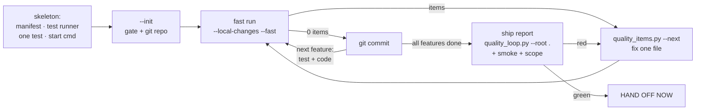
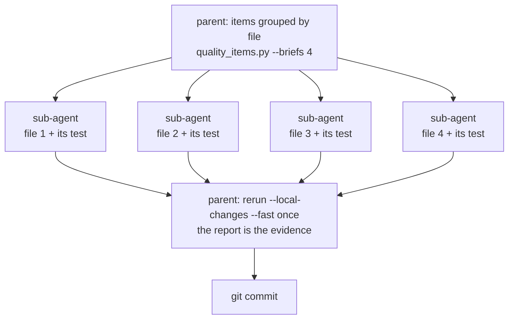

# code-discipline

A self-contained Codex and Claude Code skill for engineering discipline: rules
for readable code, a strict repository quality gate (tests, coverage,
complexity, smoke, module boundaries), and tools that install or update it on
macOS or Linux. The launcher uses Python 3.10+ or downloads a pinned runtime;
it never installs the target project's dependencies.

## The workflow the skill enforces



Bootstrap the gate before the first source file, keep every step green, commit
each green step, and hand off only after the whole-repository ship report —
which also proves the configured core user story from outside the process
(`smoke.story`; `smoke.commands` remains available for a CLI or library),
checks composed-root tests for narrow anti-vacuous mocks, and rejects
`source.exclude` entries that hide production files (the `Gate scope` row).

The nine rules of [SKILL.md](skills/code-discipline/SKILL.md), one line each:

1. Deliverables first, gate before source — `--init` before the first feature.
2. Read the report, not the state file; fix one file per cycle.
3. Run the loop in the foreground only; never background it.
4. The core user story must run: structured smoke probes are part of the report.
5. Not finished until the ship report is green; never narrow the gate.
6. Mutation and flaky testing run only when asked.
7. Green means hand off now — nothing is added after green.
8. Commit each green step locally; push or rewrite history only when asked.
9. Fan out sub-agents by file, at most four, and measure once (below).

## Fanning out repair work

When a report lists items in many files — adopting the gate in an existing
repository, or any large first report — the parent delegates disjoint files
and keeps the only measurement:



Sub-agents never run `--init`, never edit `.quality/`, never commit; shared
modules (types, schemas, contracts) are edited by the parent first; a
sub-agent's "green" is a claim, the parent's single rerun is the evidence.

## Install from GitHub

In the current repository:

```bash
curl -fsSL -H "Accept: application/vnd.github.raw+json" "https://api.github.com/repos/benrben/code-skills/contents/skills/code-discipline/scripts/install.py?ref=main" | python3 - --repo --root .
```

Globally for all repositories on this computer:

```bash
curl -fsSL -H "Accept: application/vnd.github.raw+json" "https://api.github.com/repos/benrben/code-skills/contents/skills/code-discipline/scripts/install.py?ref=main" | python3 - --global
```

Restart the agents after the first installation. Codex reads
`.agents/skills/code-discipline`; Claude Code reads its `.claude/skills` link.
Global installation creates the same paths under `$HOME` without cloning.

## Update

```bash
python3 .agents/skills/code-discipline/scripts/install.py --update-current
python3 "$HOME/.agents/skills/code-discipline/scripts/install.py" --update-current
python3 .agents/skills/code-discipline/scripts/install.py --update-all
```

The first two update this repository and the global copy (`--ref TAG_OR_COMMIT`
pins a version); the third refreshes every recorded copy. Updates preserve
repository configuration, [refresh pinned toolchains and saved HTML](skills/code-discipline/references/quality-loop.md#entrypoint-and-configuration),
and restore each `.claude/skills` link. Every skill change is also published as
`oci://ghcr.io/benrben/code-skills.code-discipline:latest`.

## Run the quality gate

```bash
.agents/skills/code-discipline/scripts/quality --root . --init --non-interactive
.agents/skills/code-discipline/scripts/quality --root . --local-changes --fast
python3 .agents/skills/code-discipline/scripts/quality_items.py --root . --next
.agents/skills/code-discipline/scripts/quality --root .   # ship report
```

Targeted checks never certify: `--lint`, `--types`, `--contracts`,
`--tests`, `--coverage`, `--branches`, `--slow-tests`,
`--extension-contracts`, `--extension-deps`, `--failure-paths`,
`--silent-errors`, `--test-integrity`, `--complexity`, `--crap`, `--loc`,
`--dead-code`, `--deps`, `--test-count`, `--cognitive`, `--duplication`,
`--cycles`, `--secrets`, `--vulnerabilities`, `--hotspots`, `--smoke`, `--gherkin`, plus
`--flaky` and `--mutation` on request. Every run
prints each gate and the separate product/security/deployment/operations
coverage profile, `Coverage today`, `Since last run: fixed · remaining · new`, a `To fix` list grouped by file when it is long, the exact next command, and
`QUALITY_LOOP=` / `ITEMS_TO_FIX=`. Every run writes `.quality/quality-gate-report.html`
and `.quality/quality-gate-state.json`; `--html PATH` moves the HTML. Defaults:
600 lines per file, 100% per-function line and branch coverage, 5 seconds per
test, 300 seconds per suite, 100% extension contracts, no core-to-extension
imports, 100% failure-path coverage, no silent handlers, at least one executed
test with none skipped, cognitive complexity 15, nesting depth 4, duplicated
code 5%, zero dependency cycles, secrets, or known vulnerabilities, and
cyclomatic complexity and CRAP at 6. Write Gherkin scenarios in `.feature.yaml`; all
scenarios, Examples rows, steps and hooks must pass. Only a full run prints
`QUALITY_LOOP=PASS`; selected checks print `QUALITY_LOOP=SELECTED_PASS`.
The launcher caches pinned tools/Python; it never restores project dependencies. The
[setup guide](skills/code-discipline/references/repository-setup.md) covers adapters and formulas;
the [loop reference](skills/code-discipline/references/quality-loop.md) covers reports, repairs, and delegation.

## Prompt for an agent: install in this repository

```text
Install the complete code-discipline skill in this repository using the
repository install command in README.md. Do not clone the code-skills repo.
Preserve existing work and quality configuration. Read repository-setup.md,
configure this repository's real toolchain, verify both scripts with
--version, then run the fast local-change loop and report the results.
```

## Verify and develop

```bash
python3 .agents/skills/code-discipline/scripts/quality --version   # 5.0.0
python3 -m venv .venv && .venv/bin/python -m pip install -r requirements-dev.txt
.venv/bin/python -m unittest discover -s tests
skills/code-discipline/scripts/quality --root . --no-install
```

The full gate uses `.venv` and `.quality/quality-thresholds.json`. In blind A/B
rounds, v3.5 delivered 3 of 4 green hand-offs where v3.4 delivered 0 of 2;
fan-out also cleared a previously fatal 95-item report.
