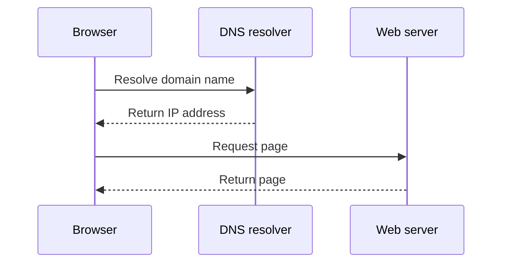

# Diagrams

Use this mode when spatial arrangement makes relationships easier to see.
Choose the visual grammar to match the question:

| Question | Suitable diagram |
| --- | --- |
| What happens next, and where are the decisions? | Flowchart |
| Who sends what, and in what order? | Sequence diagram |
| Which parts connect or depend on each other? | Architecture or dependency diagram |
| What states and transitions are possible? | State diagram |
| How do measured quantities compare or change? | Chart with axes and units |

Do not force quantitative data into boxes and arrows when a chart explains it.
Distinguish a sequence from a dependency and a correlation from a cause.

## Build the explanation

Write down the entities and relationships first. Each arrow must have a
specific meaning. Label ambiguous arrows with a verb or relationship. Keep
names consistent with the accompanying explanation.

Use Mermaid for small structural diagrams when the conversation or target
renderer supports it. Use SVG or an editable diagram format for spatial detail
or more control over layout. Prefer code or vector diagrams for precise labels
and relationships; use generated raster imagery when illustration is the point.

Show one coherent view. Split an overloaded diagram into an overview and detail
views rather than shrinking its labels. Add a short interpretation of what the
reader should notice. Do not encode a distinction by color alone.

Provide an accessible title and text equivalent. Mermaid supports `accTitle`
and `accDescr`; complex visuals may also need an adjacent explanation or data
table. See [Mermaid accessibility](https://mermaid.js.org/config/accessibility)
and [W3C complex image guidance](https://www.w3.org/WAI/tutorials/images/complex/).

## Example

Prompt: “Show how a browser resolves a domain name and requests a web page.
Use a sequence diagram. State the simplifying assumptions.”

This overview omits cached DNS results, connection setup, and additional resource
requests. Include those only when they are part of the learning goal.

## Verify

Check the source against the actual system or evidence. Render with the target
renderer when available and inspect labels, arrow directions, crossings, and
clipping at the expected display size. A syntax check does not prove that the
relationships are correct. If rendering is unavailable, state that limit.
