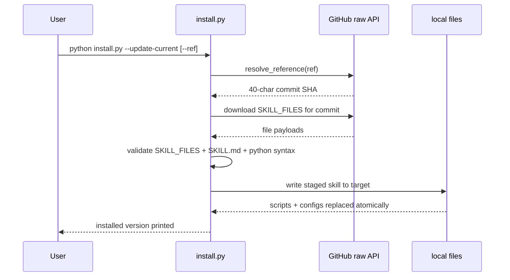

# Architecture diagrams

This document provides Mermaid diagrams for the entire `code-discipline` repository.

## 1) Repository module map

```mermaid
flowchart LR
    Root[Repository Root] --> Entry[repo_quality_gate.py]
    Root --> QualityLoop[skills/code-discipline/scripts/quality_loop.py]
    Root --> QualityItems[skills/code-discipline/scripts/quality_items.py]
    Root --> QualityReport[skills/code-discipline/scripts/quality_report.py]
    Root --> Install[skills/code-discipline/scripts/install.py]
    Root --> Smoke[skills/code-discipline/scripts/smoke_check.py]
    Root --> Tests[tests/test_repo_quality_gate.py]
    Root --> Docs[skills/code-discipline/{SKILL.md,references}]

    QualityLoop -->|loads| Core[Core gate engine (quality_loop imports repo_quality_gate)]
    QualityLoop -->|reads| QualityReport
    QualityLoop -->|reads| QualityItems
    QualityItems -->|reads| CoreState
    Core -->|writes| GateJSON[.quality/quality-gate.json]
    Core -->|writes| Thresh[.quality/quality-thresholds.json]
    Core -->|writes| Deps[.quality/quality-dependencies.json]
    Core -->|writes| State[.quality/quality-gate-state.json]
    Core -->|writes| HTML[.quality/quality-gate-report.html]
```

## 2) Quality loop execution path

```mermaid
flowchart TD
    Start[CLI call: python quality_loop.py --root . --fast] --> Args[Parse arguments and lock repository]
    Args --> RunSetup[Resolve config/gate files and gate selection]
    RunSetup --> Measure[repo_quality_gate.run()]
    Measure --> CommandAdapters[Run formatter/lint/tests/etc. adapters]
    CommandAdapters --> GateChecks[Each gate computes pass/fail items]
    GateChecks --> Report[quality_report.print_report()]
    Report --> WriteState[Persist JSON + HTML reports]
    WriteState --> Exit[Exit status + next command text]
```

## 3) Install flow



## 4) Repair loop for one file (per code discipline rule)

```mermaid
flowchart LR
    L0[Run quality loop (fast)] --> L1{Exit status}
    L1 -->|1: fail| L2[quality_items.py --next]
    L2 --> L3[Fix one file]
    L3 --> L0
    L1 -->|1 and READY_FOR_FULL| L4[Commit step]
    L4 --> L0
    L1 -->|0| L5[Run full ship report: quality_loop.py --root .]
    L5 --> H{All gates green?}
    H -->|Yes| Done[HAND OFF NOW]
    H -->|No| L2
```
